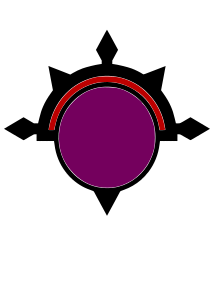
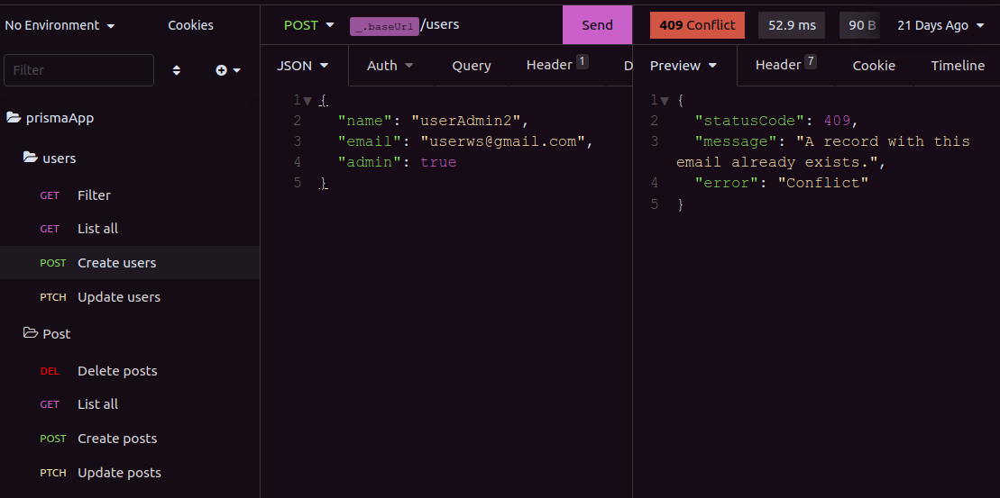

<h3 align="center">
  

Totti for <a href="https://insomnia.rest/">Insomnia</a>

<h/3>

  <a href="https://github.com/fernandobortotti/totti-theme-insomnia" target="_blank">
    
     
    
  </a>

## Screenshots

Default

## Installation

1. Navigate to **`Preferences > Plugins`**
2. In the **`"Install plugin"`** field, enter **`insomnia-plugin-theme-totti`**
3. Click **`"Install plugin"`**
4. Navigate to **`Preferences > Themes`** and you should see **Totti** theme available.

## 🖖 Tks

Copyright &copy; 2022-present <a href="https://github.com/fernandobortotti" target="_blank">Bortotti Org</a>

